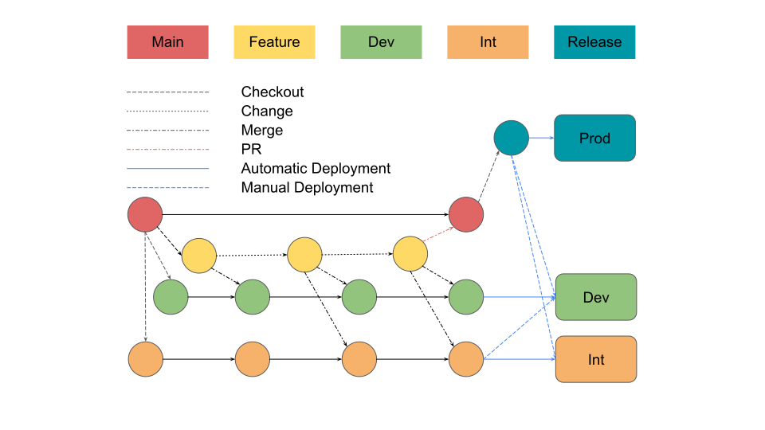

# db-schema-mgmt-mysql
Schema Management for MySQL

## Premise
Databases are `storage class` applications, and, unlike `compute class` applications, which, today, are designed to be mostly stateless, databases have persistent state - their data. This data is usually important and we do not want to lose it. When we change the `compute class` apps we no longer do an `in-place upgrade`, we do a `clean install` of another version, gradually switch to the new version, then destroy the old one. This guarantees a known final `desired state`. When we change the `storage class` apps we take great care not to destroy the data itself. In case of databases there are two types of data. Data which we store, and [data definition](https://en.wikipedia.org/wiki/Data_definition_language), which defines what data that we store looks like. Also known as [schema](https://en.wikipedia.org/wiki/Database_schema). When we change the schema, we can't do a `clean install` of schema, like we do with `compute class` apps. If we did that, we'd lose our data. What we usually do is [evolve](https://en.wikipedia.org/wiki/Evolutionary_database_design) the schema incrementally without affecting existing data. That is a long way to say that we do an `in-place upgrade`. This puts us directly at our final `desired state`. But what we miss in the process is a trackable `desired state` management. There is no audit trail, no versioning, no predictable and consistent means to deploy the same change across multiple environments and keep these environments in sync. This void is what the propsed approach is trying to address.   

## Process
As developers, we want our dev cycles to be short. We want to modify schema directly in the database. Test it. Repeat until happy. Ultimately, whatever we change in our playground needs to end up in other environments that actually serve our customers. Luckily for us there is a wondeful [sqldef](https://github.com/sqldef/sqldef) tool that allows us to compare a schema currently in the live database to the schema on disk. And since it is on disk, we can store the desired schema in version control with all the benefits that arise from it. We will no longer treat schema changes as individual discrete DDL commands. From this point on we can make the changes to schema in version control and apply that `desired state` of the schema to other environments. What it means is that when we want to add a field to a table, instead of manually crafting an `ALTER TABLE` command for the `in-place upgrade`, we just add the field we need directly to the `CREATE TABLE` command in the schema file. As if we were doing a `clean install`.  

Lets use [example/](example/) to illustrate this.

1. Start a plain mysql database in docker:
```
./start-mysqld.sh
```
This will take a minute, please stand by.

2. Apply the first tag (1.0.0) of the schema.sql
```
$ ../apply.sh schema.sql 1.0.0
No local changes to save
Updated 1 path from e8cdc0c
Updated 1 path from 701e7bb
No stash entries found.
START TRANSACTION;
SET FOREIGN_KEY_CHECKS = 0;

-- dry run --
CREATE TABLE `user` (
  `id` bigint(20) unsigned NOT NULL AUTO_INCREMENT,
  `name` varchar(191) NOT NULL,
  PRIMARY KEY (`id`)
) ENGINE=InnoDB DEFAULT CHARSET=utf8mb4;

SET FOREIGN_KEY_CHECKS = 1;
COMMIT;

This would be a good time to create a snapshot of our db.
mysql: [Warning] Using a password on the command line interface can be insecure.
This would be a good time to cleanup old snapshots of our db.
```

3. Modify schema.sql and create 1.0.1

Change this:  
```
CREATE TABLE `user` (
  `id` bigint(20) unsigned NOT NULL AUTO_INCREMENT,
  `name` varchar(191) NOT NULL,
  PRIMARY KEY (`id`)
) ENGINE=InnoDB DEFAULT CHARSET=utf8mb4;
```
  
To this:  
```
CREATE TABLE `user` (
  `id` bigint(20) unsigned NOT NULL AUTO_INCREMENT,
  `name` varchar(191) NOT NULL,
  `created_at` TIMESTAMP DEFAULT CURRENT_TIMESTAMP,
  PRIMARY KEY (`id`)
) ENGINE=InnoDB DEFAULT CHARSET=utf8mb4;
```

Commit it to version control and tag 1.0.1. 

4. Check 1.0.1 changes before applying them.
```
$ ../plan.sh schema.sql 1.0.1
-- dry run --
ALTER TABLE `user` ADD COLUMN `created_at` timestamp DEFAULT current_timestamp AFTER `name`;
```
This tells us that to apply our new `desired state`, these DDL commands will need to be issued.  
If this passes our sanity check we can go ahead and apply the change:
```
$ ../apply.sh schema.sql 1.0.1
START TRANSACTION;
SET FOREIGN_KEY_CHECKS = 0;

-- dry run --
ALTER TABLE `user` ADD COLUMN `created_at` timestamp DEFAULT current_timestamp AFTER `name`;

SET FOREIGN_KEY_CHECKS = 1;
COMMIT;

This would be a good time to create a snapshot of our db.
mysql: [Warning] Using a password on the command line interface can be insecure.
This would be a good time to cleanup old snapshots of our db.
```

This simple process allows us to keep track of our changes forward. But sometimes we need to rollback our changes. And if the original schema without our change had a tag 1.0.0, we can now return to that state by running:

```
$ ../apply.sh schema.sql 1.0.0
No local changes to save
Updated 1 path from e8cdc0c
Updated 1 path from 701e7bb
No stash entries found.
START TRANSACTION;
SET FOREIGN_KEY_CHECKS = 0;

-- dry run --
ALTER TABLE `user` DROP COLUMN `created_at`;

SET FOREIGN_KEY_CHECKS = 1;
COMMIT;

This would be a good time to create a snapshot of our db.
mysql: [Warning] Using a password on the command line interface can be insecure.
This would be a good time to cleanup old snapshots of our db.
```


## Feature branching and release cycle
### Environment Branches Flow git workflow
> Based on [GitFlow](https://www.atlassian.com/git/tutorials/comparing-workflows/gitflow-workflow) with one major difference.  
> GitFlow starts releases from `develop` branch.  
> We start releases from `main` branch.


1. Create a `feature` branch from `main`.
2. Make changes and test them locally.
3. Commit and push changes into the `feature` branch.
4. Merge `feature` branch into the `dev` branch.
5. Deploy `dev` branch into the `Dev` environment.
> Via CI/CD
6. Test the `Dev` environment.
7. Merge `feature` branch into the `int` branch.
8. Deploy `int` branch into the `Int` environment.
> Via CI/CD
9. Test the `Int` environment.
10. Merge `feature` branch into the `main` branch.
11. Tag `main` branch with a version.
12. Deploy the `tag` into the `Prod` environment.
> Via CI/CD


### Branch naming conventions
Each change branch should start with either a `feature/change_` or a `feature/rollback_` prefix to make it easier to track the purpose of the change.

1. Add an index
> feature/change_application_name_1.2.3

2. Rollback
> feature/rollback_application_name_1.2.3
