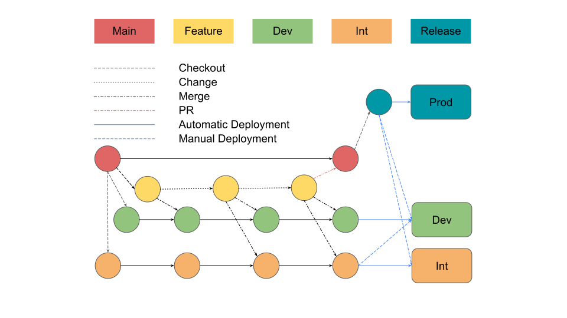

# db-schema-mgmt-mysql
Schema Management for MySQL

## Premise
Databases are `storage class` applications, and unlike `compute class`, which, today, is designed to be mostly stateless, databases have persistent state - their data. This data is usually important and we do not want to lose it. When we change the `compute class` apps we can easily destroy and recreate them. Or better yet, create new versions of them first, seamlessly switch to the new versions, then destroy the old ones. When we change the `storage class` apps we take great care not to destroy the data itself. In case of databases there are two types of data. Data that we store, and [data definition](https://en.wikipedia.org/wiki/Data_definition_language), which defines what data that we store looks like. Also known as [schema](https://en.wikipedia.org/wiki/Database_schema). When we change the schema, we do not drop and recreate schema, like we do with `compute class` apps. This would be a lossy operation. What we usually do is [evolve](https://en.wikipedia.org/wiki/Evolutionary_database_design) the schema incrementally without affecting existing data. This puts us directly at our final `desired state`. But what we miss in the process is a trackable `desired state` management. There is no audit trail, no versioning, no predictable and consistent means to deploy the same change across multiple environments and keep these environments in sync. This void is what the propsed approach is trying to address.   

## Process
### Develop changes
  As developers, we want a direct access to the resources we are working on. This is easily achievable in our cozy developer space. We can manually tweak and tune the `dev` level systems, but at the end of the day, when we are happy with our progress, we need to produce a `unit of change` that can be consistenly applied to our `prod` level systems. This is where the feature branching comes in.
### Identify changes
### Deploy changes
### Rollback changes 

## Feature branching and release cycle
### Branch-to-environment release git workflow
> Based on [GitFlow](https://www.atlassian.com/git/tutorials/comparing-workflows/gitflow-workflow) with one major difference.  
> GitFlow starts releases from `develop` branch.  
> We start releases from `master` branch.

1. Create a `feature` branch from `master`.
2. Make changes and test them locally.
3. Commit and push changes into the `feature` branch.
4. Merge `feature` branch into the `dev` branch.
5. Deploy `dev` branch into the `Dev` environment.
> Via CI/CD
6. Test the `Dev` environment.
7. Merge `feature` branch into the `int` branch.
8. Deploy `int` branch into the `Int` environment.
> Via CI/CD
9. Test the `Int` environment.
10. Merge `feature` branch into the `master` branch.
11. Tag `master` branch with a version.
12. Deploy the `tag` into the `Prod` environment.
> Via CI/CD

### Branch naming conventions
Each change branch should start with either a `feature/change_` or a `feature/rollback_` prefix to make it easier to track the purpose of the change.

1. Add an index
> feature/change_application_name_1.2.3

2. Rollback
> feature/rollback_application_name_1.2.3
